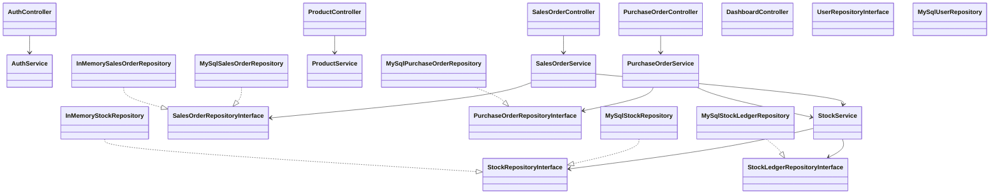

# Software Design Document (SDD)
## Inventory & Order Management System

**Source of truth:** Intermediate Programmer - Final Project Brief, Participant Guide Edisi 1.0, Oktober 2026.  
**Target implementation:** PHP 8.2+ Native OOP, MySQL 8, HTML/CSS, Vanilla JavaScript + Fetch API, Docker Compose, PHPUnit, static analysis.  
**Audience:** Developer / Codex agent / assessor.  
**Status:** Implementation-ready baseline.

---

## 1. Purpose

Dokumen ini menerjemahkan project brief menjadi rancangan software yang dapat langsung digunakan sebagai kontrak implementasi. Fokusnya adalah memenuhi seluruh requirement wajib dengan arsitektur pragmatis, dapat diuji, concurrency-safe untuk stok, dan mudah dipertahankan saat technical defense.

Prinsip utama:

1. Jangan menambah kompleksitas yang tidak diminta.
2. Business rule berada di Service, bukan di Controller, view, atau JavaScript.
3. Akses data berada di Repository dengan PDO prepared statement.
4. Boundary repository memakai interface untuk mendukung Dependency Inversion dan unit test dengan fake/in-memory implementation.
5. Semua perubahan stok hanya lewat stock operation service yang menulis `stock_ledger` dan memperbarui `product_stocks` dalam transaksi yang sama.
6. Authorization ditegakkan di server.
7. Dashboard/report mengambil angka dari query nyata/agregasi, bukan hardcoded.
8. Semua keputusan yang signifikan harus dapat dilacak ke requirement ID dan evidence.

---

## 2. Scope

### 2.1 In scope

- Authentication: login, session, logout.
- User management untuk Admin, Sales, Warehouse Staff.
- Master data: category, product, warehouse, supplier, customer.
- Multi-warehouse stock.
- Purchase Order dan partial/full goods receipt.
- Sales Order, submission, approval/rejection/cancellation, goods issue/fulfillment.
- Stock ledger.
- Search, filter, sort, pagination.
- Role-based dashboard.
- CSV report.
- Minimal satu JSON API.
- Validation dan safe error handling.
- Responsive UI.
- Dockerized application + MySQL.
- Scheduled/manual low-stock script.
- Unit tests, integration tests, static analysis.
- Architecture artifacts: ERD, initial/as-built class diagram, ADR, refactor log, SRP audit, tech debt, critique.
- AI usage log.

### 2.2 Out of scope

Jangan implementasikan kecuali semua requirement wajib stabil:

- Microservices.
- Message queue production.
- Cloud deployment.
- Kubernetes.
- Mobile application.
- Real-time notification.
- Automated cron scheduler di server penilaian.
- Full automated E2E suite.
- Frontend framework, CSS framework, backend framework, ORM, framework DI container.

---

## 3. Technology Constraints

| Area | Wajib | Tidak boleh |
|---|---|---|
| Frontend | HTML semantik, CSS buatan sendiri, Vanilla JS, Fetch API | React, Vue, Angular, jQuery, CSS framework, admin template siap pakai |
| Backend | PHP 8.2+ Native OOP, Controller-Service-Repository, constructor injection | Laravel, CodeIgniter, Symfony, Slim, ORM, CRUD generator, framework DI container |
| Database | MySQL 8, PDO prepared statement, FK, constraints, indexes, explicit transactions | NoSQL utama, raw string concatenation untuk input user |
| Runtime | Dockerfile, Docker Compose, `.env.example` | Setup yang hanya bekerja di komputer peserta |
| Testing | PHPUnit unit + integration, static analysis | Trivial getter/setter tests, skipped-only tests |

Composer diperbolehkan untuk autoload dan dev dependencies.

---

## 4. Actors and Authorization Matrix

### 4.1 Roles

- `Admin`
- `Sales`
- `WarehouseStaff`

### 4.2 Authorization rules

| Capability | Admin | Sales | Warehouse Staff |
|---|---:|---:|---:|
| Login/logout/profile | Yes | Yes | Yes |
| Manage users | Yes | No | No |
| Manage master data | Yes | Read catalog | Read product + stock |
| Create Sales Order | Yes | Yes, own | No |
| Submit Sales Order | Yes | Yes, own | No |
| Approve/reject Sales Order | Yes | No | No |
| Create Purchase Order | Yes | No | Yes / propose |
| Goods receipt | Yes | No | Yes |
| Goods issue | Yes | No | Yes |
| Dashboard | Global | Own orders | Stock & fulfillment |
| CSV report | Global | Own orders | Stock report |

### 4.3 Segregation of duties

Server MUST reject approval attempts from Sales, even if endpoint is called manually. UI hiding is not sufficient. Authorization rule must be tested independently from frontend.

---

## 5. Core Business Workflows

### 5.1 Authentication

```text
Anonymous -> POST login -> validate credentials/status -> regenerate session ID
          -> store authenticated user identity + role -> role dashboard
Authenticated -> logout -> clear auth session -> anonymous
```

Security rules:

- `password_hash()` for storage.
- `password_verify()` for login.
- Generic invalid credential message.
- Inactive user cannot login.
- Protected pages/API require authenticated session.
- Unauthorized operation returns 403 or equivalent safe response.

### 5.2 Purchase Order

```text
Draft -> Ordered -> PartiallyReceived -> Received
  |         |              |
  +---------+--------------+-> Cancelled (only when business rules allow)
```

Receipt behavior:

1. Verify actor may receive PO.
2. Verify PO status permits receipt.
3. Validate each received quantity > 0 and <= remaining quantity.
4. Begin DB transaction.
5. Lock target `product_stocks` rows for `(product_id, warehouse_id)`.
6. Update/increment stock.
7. Insert `stock_ledger` row type `Receipt` per stock movement.
8. Update received quantity per PO item.
9. Recalculate PO status (`PartiallyReceived` or `Received`).
10. Commit.
11. Roll back on any failure.

### 5.3 Sales Order

```text
Draft -> PendingApproval -> Approved -> Fulfilled
  |             |              |
  +-------------+--------------+-> Cancelled before Fulfilled
```

Rules:

- Sales may only manage own Sales Orders.
- Sales cannot approve/reject.
- Only Admin approves/rejects.
- Goods issue only from `Approved`.
- Goods issue fails if available stock insufficient.
- Fulfilled only after successful issue for all items.

### 5.4 Concurrency-safe goods issue

Chosen baseline mechanism: **transaction + `SELECT ... FOR UPDATE` row locking** on the relevant `product_stocks` rows.

Pseudo-flow:

```text
BEGIN
SELECT quantity
FROM product_stocks
WHERE product_id = :product AND warehouse_id = :warehouse
FOR UPDATE;

IF quantity < issue_qty:
    ROLLBACK
    throw InsufficientStock

UPDATE product_stocks
SET quantity = quantity - :issue_qty
WHERE product_id = :product AND warehouse_id = :warehouse;

INSERT INTO stock_ledger(..., movement_type='Issue', quantity=:issue_qty, ...);
...
COMMIT
```

Why this design:

- Two competing issues serialize on the same stock row.
- The second transaction reads the post-commit quantity after acquiring the lock.
- Oversell is prevented without distributed infrastructure.
- Mechanism is explainable and testable in MySQL/InnoDB.

Do not update stock from UI/controller/repository ad hoc.

---

## 6. Domain Model

### 6.1 User

Fields:

- id
- name
- email unique
- password_hash
- role enum: `Admin`, `Sales`, `WarehouseStaff`
- is_active
- created_at
- updated_at

### 6.2 Warehouse

- id
- name
- location
- is_active
- timestamps

### 6.3 Category

- id
- name
- description nullable
- timestamps

### 6.4 Product

- id
- sku unique
- name
- category_id
- unit
- purchase_price >= 0
- selling_price >= 0
- reorder_point >= 0
- image_path nullable
- is_active
- timestamps

### 6.5 ProductStock

- id
- product_id
- warehouse_id
- quantity >= 0
- updated_at
- unique `(product_id, warehouse_id)`

### 6.6 Supplier / Customer

- id
- name
- contact
- address
- is_active
- timestamps

### 6.7 PurchaseOrder

- id
- order_number unique
- supplier_id
- destination_warehouse_id
- status enum: `Draft`, `Ordered`, `PartiallyReceived`, `Received`, `Cancelled`
- order_date
- created_by
- timestamps

### 6.8 PurchaseOrderItem

- id
- purchase_order_id
- product_id
- quantity > 0
- received_quantity >= 0
- purchase_price >= 0

Invariant: `received_quantity <= quantity`.

### 6.9 SalesOrder

- id
- order_number unique
- customer_id
- source_warehouse_id
- status enum: `Draft`, `PendingApproval`, `Approved`, `Fulfilled`, `Cancelled`
- order_date
- created_by
- approved_by nullable
- approved_at nullable
- timestamps

### 6.10 SalesOrderItem

- id
- sales_order_id
- product_id
- quantity > 0
- selling_price >= 0

### 6.11 StockLedger

- id
- product_id
- warehouse_id
- movement_type enum: `Receipt`, `Issue`, `Adjustment`
- quantity > 0
- reference_type (`PO`, `SO`, optional `ADJUSTMENT`)
- reference_id
- performed_by
- created_at

Ledger is append-only under normal application operation.

---

## 7. Database Design

### 7.1 Required integrity constraints

- Unique email.
- Unique SKU.
- Unique order numbers.
- `product_stocks.quantity >= 0`.
- Prices and reorder point >= 0.
- Item quantity > 0.
- Foreign keys for all relations.
- Unique `(product_id, warehouse_id)` in `product_stocks`.

### 7.2 Recommended indexes

- `users(email)` unique.
- `products(sku)` unique.
- `products(name)`.
- `products(category_id, is_active)`.
- `product_stocks(warehouse_id, product_id)` unique or composite equivalent.
- `purchase_orders(order_number)` unique.
- `purchase_orders(status, order_date)`.
- `sales_orders(order_number)` unique.
- `sales_orders(status, order_date)`.
- `sales_orders(created_by, status)`.
- `stock_ledger(product_id, warehouse_id, created_at)`.
- `stock_ledger(reference_type, reference_id)`.

### 7.3 Data deletion policy

Products, suppliers, customers are deactivated rather than physically deleted once referenced by transactions. Prefer soft-active flags over generic soft-delete framework behavior.

---

## 8. Application Architecture

### 8.1 Layers

```text
HTTP Request
   |
   v
Router / Front Controller
   |
   v
Controller  ----> Auth/Authorization helper
   |
   v
Service (business rules / transactions / state transitions)
   |
   v
Repository Interface
   |
   +----> MySQL Repository (PDO)
   |
   +----> InMemory/Fake Repository (unit tests)
```

### 8.2 Responsibilities

#### Controller

- Read request input.
- Invoke authorization checks.
- Convert request into service command/input DTO/array.
- Call Service.
- Convert result to HTML redirect/view or JSON response.
- Never contain transaction logic, SQL, or core business rules.

#### Service

- Business rules.
- State transitions.
- Ownership and process rules.
- Transaction orchestration for multi-repository workflows.
- Depends on interfaces.
- Must not access `$_POST`, `$_GET`, `$_SESSION`, or instantiate PDO.

#### Repository

- Persistence abstraction.
- SQL and result mapping.
- PDO lives only in infrastructure/MySQL repository implementation.
- No UI logic.

#### Entity / Domain value object

- Domain state and small invariant helpers where useful.
- Avoid anemic DTO explosion unless it adds value.

### 8.3 Manual dependency injection

Create dependencies in the composition root/front controller/bootstrap:

```php
$pdo = DatabaseFactory::create($config);
$productRepository = new MySqlProductRepository($pdo);
$stockRepository = new MySqlStockRepository($pdo);
$ledgerRepository = new MySqlStockLedgerRepository($pdo);
$stockService = new StockService($pdo, $stockRepository, $ledgerRepository);
```

Use an explicit `TransactionManager` abstraction only if it materially improves testability. Do not add a framework-like container.

---

## 9. Suggested Project Structure

```text
.
├── app/
│   ├── Controller/
│   │   ├── AuthController.php
│   │   ├── UserController.php
│   │   ├── ProductController.php
│   │   ├── PurchaseOrderController.php
│   │   ├── SalesOrderController.php
│   │   ├── DashboardController.php
│   │   ├── ReportController.php
│   │   └── Api/
│   │       └── ProductAvailabilityController.php
│   ├── Service/
│   │   ├── AuthService.php
│   │   ├── UserService.php
│   │   ├── ProductService.php
│   │   ├── PurchaseOrderService.php
│   │   ├── SalesOrderService.php
│   │   ├── StockService.php
│   │   ├── DashboardService.php
│   │   └── ReportService.php
│   ├── Repository/
│   │   ├── Contract/
│   │   │   ├── ProductRepositoryInterface.php
│   │   │   ├── StockRepositoryInterface.php
│   │   │   ├── SalesOrderRepositoryInterface.php
│   │   │   └── ...
│   │   ├── MySql/
│   │   └── InMemory/
│   ├── Entity/
│   ├── Security/
│   │   ├── AuthContext.php
│   │   └── Authorization.php
│   ├── Http/
│   │   ├── Request.php
│   │   ├── Response.php
│   │   └── Router.php
│   ├── Validation/
│   └── Exception/
├── config/
│   ├── bootstrap.php
│   └── config.php
├── public/
│   ├── index.php
│   ├── assets/css/
│   ├── assets/js/
│   └── uploads/products/
├── views/
│   ├── layouts/
│   ├── auth/
│   ├── dashboard/
│   ├── products/
│   ├── purchase-orders/
│   ├── sales-orders/
│   └── errors/
├── database/
│   └── schema-and-seed.sql
├── scripts/
│   └── check-low-stock.php
├── tests/
│   ├── Unit/
│   └── Integration/
├── docs/
│   ├── planning/
│   ├── architecture/
│   ├── quality/
│   └── testing/
├── Dockerfile
├── compose.yaml
├── .env.example
├── composer.json
├── phpunit.xml
├── phpstan.neon
├── README.md
└── ai-usage-log.md
```

Folder names may vary, but responsibility boundaries must remain clear.

---

## 10. Routing Contract

Suggested routes; exact URI may differ, but behavior must stay equivalent.

### Authentication

- `GET /login`
- `POST /login`
- `POST /logout`

### Users

- `GET /users`
- `GET /users/create`
- `POST /users`
- `GET /users/{id}/edit`
- `POST /users/{id}`
- `POST /users/{id}/status`

### Products / master data

- `GET /products`
- `GET /products/{id}`
- `GET /products/create`
- `POST /products`
- `GET /products/{id}/edit`
- `POST /products/{id}`
- `POST /products/{id}/status`

Equivalent CRUD/read routes for categories, warehouses, suppliers, customers.

### Purchase Orders

- `GET /purchase-orders`
- `GET /purchase-orders/{id}`
- `GET /purchase-orders/create`
- `POST /purchase-orders`
- `POST /purchase-orders/{id}/order`
- `POST /purchase-orders/{id}/receive`
- `POST /purchase-orders/{id}/cancel`

### Sales Orders

- `GET /sales-orders`
- `GET /sales-orders/{id}`
- `GET /sales-orders/create`
- `POST /sales-orders`
- `POST /sales-orders/{id}/submit`
- `POST /sales-orders/{id}/approve`
- `POST /sales-orders/{id}/reject-or-cancel`
- `POST /sales-orders/{id}/issue`

### Dashboard/report/API

- `GET /dashboard`
- `GET /reports/stock-ledger.csv`
- `GET /reports/orders.csv`
- `GET /api/products/{sku}/availability`

---

## 11. JSON API Contract

### GET `/api/products/{sku}/availability`

Authentication required.

#### 200

```json
{
  "sku": "SKU-001",
  "product_name": "Product 1",
  "total_quantity": 42,
  "warehouses": [
    {"id": 1, "name": "Warehouse A", "quantity": 12},
    {"id": 2, "name": "Warehouse B", "quantity": 30}
  ]
}
```

#### 401

```json
{"error":"Unauthenticated"}
```

#### 404

```json
{"error":"Product not found"}
```

Rules:

- `Content-Type: application/json`.
- Never return an HTML error page for API failures.
- Do not leak stack trace.

---

## 12. Validation Rules

### Common

- Required fields validated frontend + backend.
- Backend is source of truth.
- Enum values validated against allow-list.
- IDs must reference existing active records where required.
- Numeric values type-checked and range-checked.
- Dates validated.
- Failed validation does not persist partial transaction data.

### Product

- SKU required and unique.
- name required.
- unit required.
- category valid.
- purchase/selling price >= 0.
- reorder point >= 0.

### Image upload

- Optional.
- Validate MIME/type and file size.
- Generate random/non-guessable filename.
- Store outside source-controlled secrets/data.
- Never trust original filename as storage name.

### PO/SO items

- At least one item.
- quantity > 0.
- price >= 0.
- Duplicate product lines should either be prevented or deterministically merged; decision must be documented.

---

## 13. Search, Filter, Sort, Pagination

### Products

- Search: name/SKU.
- Filter: category.
- Filter: low-stock/normal.
- Pagination: 10 rows/page.
- Preserve query params across pagination.

Low stock definition baseline:

```text
For a product/warehouse: quantity < reorder_point
```

For dashboard, choose and document whether a product is considered low stock when any active warehouse is below reorder point or based on total stock. Prefer **per-warehouse low-stock** because the system is multi-location; aggregate presentation may additionally show product-level counts.

### Orders

- Search: order number / supplier / customer.
- Filter status.
- Sort order date ascending/descending.
- Pagination 10/page.

All sort columns must use server-side allow-lists; never interpolate arbitrary user-provided column names.

---

## 14. Dashboard Queries

### Admin

- Inventory value.
- Products below reorder point.
- PO/SO pending counts grouped by status.

Inventory value decision baseline:

```text
SUM(product_stocks.quantity * products.purchase_price)
```

Document if another valuation basis is used.

### Sales

- Counts/value of own Sales Orders grouped by status.

### Warehouse Staff

- PO receipt queue.
- SO issue queue.
- Low-stock products.

No dashboard statistic may be hardcoded.

---

## 15. CSV Reports

Required:

1. Stock movement report (`stock_ledger`) by date range.
2. Order status report by date range.

Authorization:

- Admin: full.
- Sales: own order report only.
- Warehouse Staff: stock-oriented report.

CSV safety:

- Proper CSV escaping.
- Consider neutralizing formula injection for text fields beginning with `=`, `+`, `-`, `@`.
- Output correct headers and download content type.

---

## 16. Error Handling

- 401 / login redirect for unauthenticated browser pages according to route type.
- 403 for authenticated but unauthorized.
- 404 for missing resource.
- 422 or form feedback for validation failure where appropriate.
- 409 may be used for invalid state transition/conflict if API-style semantics are used.
- Database exceptions logged server-side; user sees safe message.
- Never output SQL, stack trace, secret, or raw exception detail in production mode.

---

## 17. Security Design

Mandatory controls:

- Password hashing API.
- Session ID regeneration after login.
- Server-side authorization.
- PDO prepared statements for user input.
- HTML output escaping (`htmlspecialchars(..., ENT_QUOTES, 'UTF-8')`).
- `.env` ignored; `.env.example` contains placeholders only.
- File upload allow-list and randomized filename.
- No client/PII/proprietary code in AI logs.

Recommended, low-complexity additions:

- CSRF token for state-changing form actions.
- Secure/HttpOnly/SameSite session cookie config where environment supports it.
- POST-only logout.
- Max upload size both PHP config and application validation.

These recommendations must not delay mandatory scope.

---

## 18. Testing Strategy

### 18.1 Unit tests - minimum 6 across >=3 logic areas

Required baseline set:

1. `SalesOrderServiceTest::salesCannotApproveOrder()`
2. `SalesOrderServiceTest::cannotIssueWhenStatusIsNotApproved()`
3. `SalesOrderServiceTest::cannotTransitionFulfilledBackToDraft()`
4. `PurchaseOrderServiceTest::partialReceiptKeepsRemainingQuantity()`
5. `StockPolicyTest::insufficientStockIsRejected()`
6. `LowStockPolicyTest::quantityBelowReorderPointIsLowStock()`

Recommended additional tests:

- inactive user cannot authenticate.
- invalid PO item quantity rejected.
- Sales accesses only own order.
- duplicate email/SKU validation mapping.

Unit tests MUST run without real PDO/session/network.

### 18.2 Integration tests - minimum 3 against real MySQL Docker

Baseline:

1. Full goods receipt increments `product_stocks` and inserts `Receipt` ledger.
2. Partial goods receipt updates received quantity and PO status correctly.
3. Sequential concurrency scenario: first goods issue consumes stock; second issue is rejected and no negative stock/extra ledger row is created.

Recommended fourth:

4. Transaction rollback: force ledger insert/update failure and assert stock remains unchanged.

### 18.3 FIRST

- Fast.
- Independent.
- Repeatable.
- Self-validating.
- Timely.

No `sleep()`, external network, or order-dependent tests.

---

## 19. Static Analysis and Code Standard

Baseline choice: **PHPStan level 5+**. PSR-12 formatting should also be followed even if PHP_CodeSniffer is not the primary assessment artifact.

Deliver:

- `docs/quality/phpstan-report.txt` or equivalent.
- Zero critical errors.
- Remaining warnings documented in tech debt or quality notes.

---

## 20. Docker Design

Minimum services:

- `web` / `app` PHP service.
- `db` MySQL 8 service.

Example runtime requirements:

- Build from clean checkout with `docker compose up --build`.
- `.env.example` documents required variables.
- Schema and seed can initialize empty DB.
- Tests can connect to a dedicated/test database inside Docker.
- No absolute host paths.

Recommended commands in README:

```bash
docker compose up --build -d
docker compose exec app composer install
docker compose exec app php database/... # only if needed by chosen init approach
docker compose exec app vendor/bin/phpunit --testsuite Unit
docker compose exec app vendor/bin/phpunit --testsuite Integration
docker compose exec app vendor/bin/phpstan analyse app tests --level=5
docker compose exec app php scripts/check-low-stock.php
```

Exact commands must match implementation.

---

## 21. Demo Seed Contract

Seed MUST include at minimum:

- 1 Admin.
- >=2 Sales.
- >=2 Warehouse Staff.
- >=2 warehouses.
- >=30 products with varied reorder points.
- Several products below reorder point.
- >=25 combined PO/SO records with varied statuses.
- At least one `PendingApproval` and one `Cancelled` example.

Do not store production-like secrets. Demo credentials belong in README only if safe and clearly non-production.

---

## 22. Documentation/Evidence Contract

### `docs/planning/`

- `scope.md`
- `user-stories.md`
- `erd.md` or image/source
- `class-diagram-initial.md`
- `backlog.md`
- `trainer-decisions.md` for ambiguous requirements

### `docs/architecture/`

- `class-diagram-as-built.md`
- `adr-001-layered-repository.md`
- `adr-002-stock-concurrency.md`
- optional `adr-003-...md`

### `docs/quality/`

- `refactor-log.md` with >=3 entries, smell + technique + before/after.
- `srp-audit.md`.
- `tech-debt.md`.
- `critique.md`.
- static analysis report.

### `docs/testing/`

- test scenarios.
- test result output.
- relevant screenshots.
- known bugs.

### Root

- `ai-usage-log.md` with disclose-review-verify-test trace.

---

## 23. ADR Baselines

### ADR-001 - Repository boundary

**Context:** Business logic must be unit-testable without MySQL and must not depend directly on PDO.  
**Decision:** Service depends on repository interfaces via constructor injection; MySQL and InMemory/Fake implementations are supplied at composition root/test.  
**Consequences:** More interface/implementation files, but business logic is isolated and testable; no DI framework is required.

### ADR-002 - Concurrency-safe stock mutation

**Context:** Concurrent goods issue may oversell stock if both requests read the same quantity and update independently.  
**Decision:** Use MySQL transaction + row-level `SELECT ... FOR UPDATE` lock on relevant `product_stocks` rows, then validate quantity, update stock, append ledger, and commit atomically.  
**Consequences:** Competing stock mutations serialize per stock row; transaction boundaries must be explicit and lock order must be deterministic for multi-item orders.

### ADR-003 - Optional recommendation: deterministic lock order

For multi-item issue/receipt, sort stock keys by `(warehouse_id, product_id)` before locking. This reduces deadlock risk and makes concurrency behavior predictable.

---

## 24. Class Diagram - Initial Baseline



As-built diagram MUST be regenerated from actual code near submission; do not blindly copy this baseline.

---

## 25. Requirement Traceability Matrix

| ID | Implementation area | Primary evidence |
|---|---|---|
| AUTH-01 | AuthController/AuthService/session | login demo + tests |
| AUTH-02 | logout route/session clear | logout demo |
| USR-01 | UserController/UserService/UserRepository | CRUD + authorization demo |
| PRD-01 | Product module + upload validation | CRUD/deactivate/upload demo |
| WH-01 | Warehouse + ProductStock | two-warehouse stock demo |
| PO-01 | PurchaseOrderService + StockService | partial/full receipt + ledger |
| SO-01 | SalesOrderService + StockService | Draft->Fulfilled + auth + insufficient stock |
| VIEW-01 | views/controllers | data + empty screenshots |
| FIND-01 | repository query specs | search/filter/sort/page demo |
| DASH-01 | dashboard aggregation queries | 3 role dashboard demo |
| REPORT-01 | report query/export | CSV files |
| API-01 | API controller | 200/401/404 demo |
| VAL-01 | validators + services | invalid scenarios |
| ERR-01 | error middleware/helpers/views | intentional failure paths |
| UI-01 | responsive CSS | desktop + 360px screenshots |
| DB-01 | schema/seed/repositories | ERD + SQL + transaction/index explanation |
| JOB-01 | `scripts/check-low-stock.php` | manual Docker run |
| ARCH-01 | interfaces + fake repos | isolated service unit tests |
| ARCH-02 | stock transaction/locking | ADR + integration scenario |
| DESIGN-01 | initial/as-built diagrams | docs + code trace |
| DESIGN-02 | ADRs | docs/architecture |
| DESIGN-03 | refactor/SRP/tech debt | docs + git history |
| DESIGN-04 | critique | docs/quality/critique.md |
| TEST-01 | Unit tests | test output |
| TEST-02 | Integration tests | real MySQL test output |
| TEST-03 | PHPStan/standard | static report |

---

## 26. Implementation Sequence

Follow vertical slices, not broad horizontal scaffolding.

### Phase 0 - Bootstrap & evidence baseline

- Initialize Composer/autoload.
- Docker app + MySQL.
- Config/env loader.
- schema skeleton + seed skeleton.
- front controller/router.
- initial class diagram.
- planning docs/backlog.

### Phase 1 - Authentication & authorization

- User table/seed.
- Login/session/logout.
- protected route guard.
- role/permission authorization.
- tests.

### Phase 2 - Master data + warehouse stock read model

- categories/products/warehouses/suppliers/customers.
- activation/deactivation.
- product image validation.
- stock display total + warehouse breakdown.
- search/filter/pagination foundation.

### Phase 3 - Purchase Order vertical slice

- PO create/order.
- partial/full receipt.
- atomic stock+ledger transaction.
- integration tests.

### Phase 4 - Sales Order vertical slice

- Draft/create/edit.
- submit.
- Admin approve.
- goods issue concurrency-safe.
- insufficient stock and SoD tests.

### Phase 5 - Views/search/report/dashboard

- lists/detail/empty state.
- filtering/sorting/pagination.
- 3-role dashboards.
- CSV.

### Phase 6 - JSON API & scheduled script

- availability endpoint.
- low-stock script.

### Phase 7 - Quality/evidence

- refactor commit.
- 3-entry refactor log.
- SRP audit.
- tech debt.
- critique.
- PHPStan.
- as-built diagram.
- ADR finalization.
- AI usage log.

### Phase 8 - Release hardening

- clean clone/folder Docker setup.
- full test run.
- responsive screenshots.
- no secret scan.
- README verification.
- tag release final.

---

## 27. Definition of Done

A task is not done merely because the UI works. A requirement is done when:

1. Behavior works end-to-end.
2. Server-side validation/authorization exists.
3. Persistence uses prepared statements.
4. Relevant business logic has test coverage.
5. Error path is safe.
6. Requirement evidence exists or is easy to produce.
7. Documentation/diagram is updated when architecture changed.
8. No prohibited technology is introduced.

Release is done only if every item in the project brief submission checklist is satisfied or explicitly recorded as a limitation before final tag.

---

## 28. Critical Failure Guardrails

Codex MUST stop and flag the implementation if any of these are introduced:

- frontend/backend framework, ORM, or forbidden DI container.
- plaintext password.
- secrets committed.
- raw SQL string concatenation with user input.
- authorization implemented only in frontend.
- direct stock mutation outside stock service/ledger workflow.
- goods receipt/issue without explicit transaction.
- design docs that materially disagree with code.
- tests removed/skipped to force green build.
- fake/static dashboard data.

---

## 29. Assumptions Requiring Explicit Documentation

The brief leaves some implementation detail open. The implementation may choose, but must document, at least:

- PO cancellation rules after partial receipt.
- Whether Admin-created SO can be self-approved; safest policy is Admin may approve because segregation rule explicitly forbids Sales, but record creator/approver should remain auditable.
- Low-stock dashboard semantics across multiple warehouses.
- Order number format.
- Whether duplicate item lines are rejected or merged.
- Handling of Sales Order rejection vs `Cancelled`, since fixed status list includes `Cancelled` but wording mentions reject.
- Transaction ownership design: service directly controls PDO transaction vs dedicated transaction manager.

Do not invent trainer policy. If ambiguity affects expected assessment behavior, record it in `docs/planning/trainer-decisions.md` and ask trainer.

---

## 22. Enterprise Hardening & Added-Value Design

This section is intentionally **secondary to mandatory assessment scope**. Codex MUST NOT implement these items until all mandatory requirements are stable, tested, and documented. Added value must strengthen reliability, auditability, operability, and inventory-domain usefulness without introducing forbidden frameworks or unnecessary infrastructure.

### 22.1 Hardening tiers

```text
Tier 0 - Mandatory Assessment Core
  Docker + Auth + Master Data + PO + SO + Stock Ledger
  + Search/Filter/Pagination + Dashboard/Report + API + Job
  + Unit/Integration Tests + Static Analysis + Evidence

Tier 1 - Enterprise Hardening
  Audit Trail
  Idempotent Stock Operations
  Structured Logging
  Optimistic Locking on selected master data
  CSRF + security headers

Tier 2 - Business Extensions
  Inventory Adjustment + Approval
  Warehouse Transfer
  Low-stock to PO suggestion
  Dashboard charts
  CSV Import with preview/validation
  Optional MinIO adapter

Tier 3 - Deferred unless explicitly justified
  Stock Reservation
  Redis
  Message Queue
  External notification infrastructure
```

A higher tier MUST NOT delay or destabilize a lower tier.

### 22.2 Audit Trail

Purpose: provide accountability for security-sensitive and business-significant actions. Audit logs are distinct from stock ledger and application logs.

Suggested table:

```text
audit_logs
- id
- actor_user_id nullable
- action
- entity_type
- entity_id nullable
- before_data JSON nullable
- after_data JSON nullable
- metadata JSON nullable
- ip_address nullable
- created_at
```

Recommended events:

- `USER_CREATED`, `USER_UPDATED`, `USER_ACTIVATED`, `USER_DEACTIVATED`
- `PRODUCT_CREATED`, `PRODUCT_UPDATED`, `PRODUCT_DEACTIVATED`
- `PO_CREATED`, `PO_ORDERED`, `PO_RECEIPT_PROCESSED`, `PO_CANCELLED`
- `SO_CREATED`, `SO_SUBMITTED`, `SO_APPROVED`, `SO_CANCELLED`, `SO_FULFILLED`
- `STOCK_ADJUSTMENT_PROPOSED`, `STOCK_ADJUSTMENT_APPROVED`, `STOCK_ADJUSTED`
- `WAREHOUSE_TRANSFER_COMPLETED`

Rules:

1. Audit log MUST NOT replace StockLedger.
2. Sensitive data such as password hashes and secrets MUST NOT be persisted in audit payloads.
3. Audit creation for business-critical operations SHOULD share the same DB transaction when consistency matters.
4. Audit records are append-only from application perspective.

### 22.3 Idempotent Goods Receipt and Goods Issue

Problem: a browser retry or double-submit must not execute the same stock mutation twice.

Baseline design:

- each stock mutation command carries an `operation_key` / `idempotency_key`;
- persisted stock operation has a UNIQUE constraint on that key;
- retry returns/reuses the previously completed result instead of repeating inventory mutation;
- operation key should be generated server-side or from a protected workflow token, not trusted blindly from arbitrary user input.

Suggested stock operation table:

```text
stock_operations
- id
- operation_key UNIQUE
- operation_type: Receipt | Issue | Adjustment | Transfer
- reference_type
- reference_id
- status: Processing | Completed | Failed
- performed_by
- created_at
- completed_at nullable
```

Idempotency does **not** replace transaction + row locking. It protects against duplicate execution; row locking protects concurrent access to the same stock.

### 22.4 Structured Application Logging

Use simple structured JSON/text logs written by the application runtime. Do not add ELK/Prometheus solely for this assessment.

Example event:

```json
{
  "timestamp": "2026-10-10T09:32:15+07:00",
  "level": "INFO",
  "event": "GOODS_ISSUE_COMPLETED",
  "user_id": 12,
  "sales_order_id": 125,
  "warehouse_id": 2,
  "request_id": "..."
}
```

Keep concepts separate:

```text
StockLedger     -> authoritative inventory movement history
AuditLog        -> who changed business/security state
Application Log -> runtime diagnostics and operational events
```

### 22.5 Optimistic Locking for Master Data

For selected frequently edited master data, add integer `version` field.

Update pattern:

```sql
UPDATE products
SET name = :name,
    version = version + 1,
    updated_at = NOW()
WHERE id = :id
  AND version = :expected_version;
```

If affected rows = 0, return safe `409 Conflict` semantics and ask the user to refresh. Do not use this for inventory stock mutation; inventory uses DB transaction and row locking.

### 22.6 Security Hardening

After mandatory auth/security works, add:

- CSRF token on all state-changing browser forms.
- secure cookie configuration appropriate to environment (`HttpOnly`, `SameSite`, `Secure` when HTTPS).
- minimal security headers (`X-Content-Type-Options`, `Content-Security-Policy` where practical, `Referrer-Policy`).
- upload allow-list using actual MIME detection plus size checks.
- random/non-guessable stored product image names.
- rate-limiting is optional; do not introduce Redis solely for it.

Security hardening must remain compatible with the native PHP constraint.

---

## 23. Optional Business Extensions

### 23.1 Inventory Adjustment + Approval

Use existing StockLedger movement type `Adjustment` as a real business flow.

Suggested lifecycle:

```text
Warehouse Staff -> Propose Adjustment -> PendingApproval
Admin           -> Approve / Reject
Approved        -> StockService transaction
                 -> lock ProductStock
                 -> apply delta
                 -> append Adjustment ledger
                 -> audit
```

Suggested entities:

```text
stock_adjustments
- id
- adjustment_number UNIQUE
- warehouse_id
- status: Draft | PendingApproval | Approved | Rejected | Applied | Cancelled
- reason_code
- notes nullable
- created_by
- approved_by nullable
- approved_at nullable
- created_at / updated_at

stock_adjustment_items
- id
- stock_adjustment_id
- product_id
- system_quantity
- counted_quantity
- delta_quantity
```

Hard invariant: applied adjustment MUST never make `ProductStock.quantity < 0`.

### 23.2 Warehouse Transfer

Natural extension of multi-warehouse inventory.

Lifecycle example:

```text
Draft -> Submitted -> Approved -> Completed
                \-> Cancelled
```

Completion MUST be atomic:

1. lock source and destination stock rows in deterministic order;
2. validate source quantity;
3. decrement source;
4. increment destination;
5. append auditable movement records;
6. commit.

Because the mandatory brief defines StockLedger values as `Receipt`, `Issue`, `Adjustment`, do not silently add persistent `TransferIn/TransferOut` enum values. Two defensible options exist:

- represent transfer using `Adjustment` plus `reference_type=TRANSFER` and signed semantic metadata; or
- explicitly extend the enum and document the extension as optional scope in an ADR.

Choose one and keep it consistent.

### 23.3 Low Stock -> Purchase Order Recommendation

Dashboard/job may calculate:

```text
current_stock < reorder_point => Low Stock
```

Optional action:

- show low-stock rows;
- offer `Create Purchase Order` shortcut;
- prefill product and suggested quantity;
- user still reviews supplier, target warehouse, quantity, and price before saving.

Do not auto-create orders without user confirmation.

### 23.4 Dashboard Charts

Use SVG or Canvas written with Vanilla JS. No chart framework is necessary.

Candidate charts:

- stock movement by day;
- order count by status;
- low-stock count by warehouse;
- inventory value by category.

Chart data MUST be generated from the same underlying query/service semantics as dashboard totals.

### 23.5 CSV Product Import

Optional import workflow:

```text
Upload CSV -> Parse -> Validate -> Preview -> Confirm -> Transactional Import
```

Required validation if implemented:

- required columns;
- SKU uniqueness;
- category resolution;
- unit not blank;
- price/reorder point numeric and >= 0;
- duplicate rows detected;
- per-row error report.

Never import immediately before validation preview.

### 23.6 Optional MinIO Storage Adapter

MinIO is allowed only as optional infrastructure after the core is stable. Local filesystem remains the baseline implementation.

Design contract:

```text
FileStorageInterface
  |- LocalFileStorage
  `- MinioFileStorage (optional)
```

Product service depends on `FileStorageInterface`, not MinIO SDK details.

Do not make MinIO mandatory for clean assessment startup unless the implementation and README remain reliable from an empty environment.

---

## 24. Redis Decision

Redis is **deferred by default**.

Do not use Redis for:

- stock source of truth;
- inventory locking;
- avoiding MySQL transaction design;
- dashboard cache before performance evidence exists.

Potential future uses after mandatory scope is complete:

- session storage;
- cache for expensive non-authoritative aggregates;
- rate limiting.

Any Redis introduction requires an ADR with measurable problem, fallback behavior, consistency implications, Docker impact, and test strategy.

---

## 25. Enterprise Non-Functional Requirements

### Reliability

- core stock mutations atomic;
- retry-safe where idempotency is enabled;
- failure must not leave partial stock/order state;
- clean Docker startup is a release gate.

### Security

- server-side authn/authz;
- prepared statements;
- output escaping;
- secrets only from environment;
- upload validation;
- no sensitive debug output.

### Maintainability

- PSR-4 autoloading;
- PSR-12 style where tooling is used;
- cohesive classes;
- constructor injection;
- repository contracts;
- ADR for material design decisions;
- refactoring evidence maintained incrementally.

### Observability

- safe server logs;
- request/correlation identifier recommended;
- audit trail optional Tier 1;
- no secrets/passwords in logs.

### Performance

- pagination always used for major lists;
- indexes support filter/search patterns;
- avoid N+1-style repeated queries where one bounded query/join is clearer;
- no cache infrastructure without evidence of need.

### Data Integrity

- DB constraints reinforce service validation;
- `ProductStock` cannot be negative;
- all stock mutation creates ledger evidence;
- state transitions are explicit and testable.

---

## 26. Added-Value Quality Gates

An optional feature can be merged only when:

1. mandatory tests remain green;
2. feature has authorization rules;
3. business invariants are documented;
4. DB change has schema/seed upgrade path;
5. unit/integration tests exist where behavior is non-trivial;
6. static analysis remains acceptable;
7. SDD/as-built docs are updated;
8. known risks/tech debt are recorded;
9. clean Docker startup still succeeds;
10. feature can be explained in technical defense.

Do not implement an optional feature if it threatens submission readiness.
