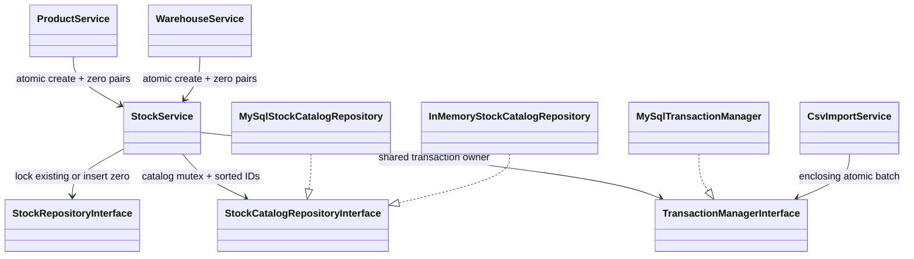

# As-Built Class Diagram

Date: 2026-08-31 (initial as-built); last updated 2026-10-07 (see "Additions and complete inventory" at the end)
Source checked: `app/**/*.php`, `public/index.php`, `composer.json`

Management pagination update: 2026-10-06. Existing grouped layer structure retained; `Pagination` now joins the Support value objects used by Management controllers/services/repositories.

This diagram reflects the implemented native PHP architecture after Phase 6. It intentionally groups repeated CRUD classes where the dependency shape is the same.

Key evidence:

- Dependency direction is controller to service to repository interface. MySQL and in-memory repositories implement the same contracts.
- `public/index.php` is the composition root and uses manual constructor injection.
- `StockService` is the only service that begins stock transactions and writes stock ledger entries.
- `NativeSessionManager` owns PHP session persistence; controllers and services consume `AuthContext` through `AuthGuard`/`SessionManager`.
- Search and pagination criteria are value objects under `app/Support`, not SQL fragments from controllers.

Audit remediation update (6 October 2026): source-order locks precede deterministic stock locks; order, stock, ledger and critical audit share one transaction. AuthGuard resolves current users through the repository boundary. CsvImportService uses TransactionManagerInterface for atomic batches, while report preview uses repository aggregates/LIMIT and HTTP CSV streams rows. Supplier/customer/warehouse lookups are loaded only for their order routes; list stock/items use batch queries.

## Catalog balance initialization — 7 October 2026

The runtime manually injects one shared StockService/TransactionManager. Opening zero pairs generate no goods movement; existing stock/ledger deltas remain exclusively in receipt/issue transactions. FormState is presentation input recovery; it does not mutate repositories/entities. ADR-006 records the initialization mutex and import nesting behavior.

## Operational boundaries

`OperationalHealthRepositoryInterface` → `MySqlOperationalHealthRepository` supplies read-only readiness/fingerprint checks to operator scripts. `JsonFileLogger` → `LogRetention` serializes rotation and append under a shared file lock. These do not participate in stock transactions or add domain authorization paths. Production HTTP still enters the existing manual composition root through Nginx/PHP-FPM. See ADR-007.

## Optional business operations (ADR-009)

BusinessOperationController delegates to BusinessOperationService, injected with BusinessOperationRepositoryInterface, StockService, transaction manager and audit boundary. OrderExceptionService uses OrderExceptionRepositoryInterface plus existing order repositories/StockService transaction boundary. MySQL and in-memory implementations retain the repository boundary. AdjustmentLedgerRepositoryInterface extends ledger capabilities without forcing legacy Receipt/Issue test doubles to implement optional operations. StockDelta carries signed changes and optional observed baseline.

WorkQueueController → WorkQueueService → WorkQueueRepositoryInterface (MySqlWorkQueueRepository), read-only role-scoped counts/page. AuthGuard required at controller; role/filter and link mapping in service; prepared UNION persistence in repository. Manual constructor injection in public/index.php. See ADR-010.

DocumentTimelineController → DocumentTimelineService → DocumentTimelineRepositoryInterface (MySqlDocumentTimelineRepository). AuthGuard at controller; source visibility checked in service before event/link queries; prepared read-only SQL projection; manual injection at composition root. ADR-011.

## Additions and complete inventory — 7 October 2026

Classes added after the grouped diagram above, with their real constructor dependencies (manual injection in `public/index.php`):

```mermaid
classDiagram
    AuditTrailController --> AuditTrailService
    AuditTrailService --> AuditQueryRepositoryInterface : read-only, Admin only
    AuditLogger --> AuditLogRepositoryInterface
    RequestAuditRecorder --> AuditLogger : best-effort request telemetry
    StockService --> AuditLogRepositoryInterface : strict movement audit in the stock transaction
    AuthService --> LoginRateLimiter
    LoginRateLimiter --> LoginAttemptRepositoryInterface : 5 failures / 15 min window
    NativeSessionManager --> SessionPolicy : idle, absolute, rotation
    PurchaseOrderService --> OperationIdempotency
    SalesOrderService --> OperationIdempotency
    OperationIdempotency --> OperationRequestRepositoryInterface : replay-safe PO receipt and SO issue (ADR-008)
    ReportService --> OperationalQueryRepositoryInterface
    ReportService ..> OutstandingCriteria : validated role scope + filters (ADR-012)
    DraftCheckController --> DraftCheckService
    DraftCheckService --> ProductRepositoryInterface
    DraftCheckService --> WarehouseRepositoryInterface
    DraftCheckService --> StockRepositoryInterface : read-only revalidation (ADR-014)
    PurchaseOrderController ..> OrderItemsInput : primary + items[n] lines (ADR-013)
    SalesOrderController ..> OrderItemsInput
    BusinessOperationController ..> BusinessOperationInput
    StockService ..> StockMovement
    StockService ..> StockDelta
    ProductService ..> ProductInput
    HttpException <|-- ForbiddenException
    HttpException <|-- UnauthenticatedException
    InvalidArgumentException <|-- ValidationException
```

- `HomeController` renders the static landing page. `PersistenceErrors` maps MySQL constraint violations (duplicate key 1062, foreign key 1451/1452, range 1406/1264, CHECK 3819) to `ValidationException` inside repositories.
- Stock proposal posting is replay-safe through its state transition (only Approved can be Posted, under lock), not through `OperationIdempotency`.
- Every repository interface has a MySQL implementation (prepared PDO) and, where services are unit-tested, an in-memory implementation; these remain grouped as `MySqlRepositories` / `InMemoryRepositories` above.

Complete class inventory generated from `app/` on 2026-10-07 (151 files):

| Directory | Count | Classes and interfaces |
|---|---|---|
| `app/Controller/` | 17 | AuditTrailController, AuthController, BusinessOperationController, CategoryController, CustomerController, DashboardController, DocumentTimelineController, DraftCheckController, HomeController, ProductController, PurchaseOrderController, ReportController, SalesOrderController, SupplierController, UserController, WarehouseController, WorkQueueController |
| `app/Controller/Api/` | 1 | ProductAvailabilityController |
| `app/Entity/` | 12 | Category, Customer, Product, ProductStock, PurchaseOrder, PurchaseOrderItem, SalesOrder, SalesOrderItem, StockLedgerEntry, Supplier, User, Warehouse |
| `app/Exception/` | 4 | ForbiddenException, HttpException, UnauthenticatedException, ValidationException |
| `app/Http/` | 4 | ErrorResponder, Request, Response, Router |
| `app/Repository/Contract/` | 23 | AdjustmentLedgerRepositoryInterface, AuditLogRepositoryInterface, AuditQueryRepositoryInterface, BusinessOperationRepositoryInterface, CategoryRepositoryInterface, CustomerRepositoryInterface, DocumentTimelineRepositoryInterface, LoginAttemptRepositoryInterface, OperationRequestRepositoryInterface, OperationalHealthRepositoryInterface, OperationalQueryRepositoryInterface, OrderExceptionRepositoryInterface, ProductRepositoryInterface, PurchaseOrderRepositoryInterface, SalesOrderRepositoryInterface, StockCatalogRepositoryInterface, StockLedgerRepositoryInterface, StockRepositoryInterface, SupplierRepositoryInterface, TransactionManagerInterface, UserRepositoryInterface, WarehouseRepositoryInterface, WorkQueueRepositoryInterface |
| `app/Repository/InMemory/` | 15 | InMemoryAuditLogRepository, InMemoryAuditQueryRepository, InMemoryBusinessOperationRepository, InMemoryCategoryRepository, InMemoryLoginAttemptRepository, InMemoryOperationRequestRepository, InMemoryOperationalQueryRepository, InMemoryOrderExceptionRepository, InMemoryProductRepository, InMemoryPurchaseOrderRepository, InMemorySalesOrderRepository, InMemoryStockCatalogRepository, InMemoryStockLedgerRepository, InMemoryStockRepository, InMemoryUserRepository |
| `app/Repository/MySql/` | 23 | MySqlAuditLogRepository, MySqlAuditQueryRepository, MySqlBusinessOperationRepository, MySqlCategoryRepository, MySqlCustomerRepository, MySqlDocumentTimelineRepository, MySqlLoginAttemptRepository, MySqlOperationRequestRepository, MySqlOperationalHealthRepository, MySqlOperationalQueryRepository, MySqlOrderExceptionRepository, MySqlProductRepository, MySqlPurchaseOrderRepository, MySqlSalesOrderRepository, MySqlStockCatalogRepository, MySqlStockLedgerRepository, MySqlStockRepository, MySqlSupplierRepository, MySqlTransactionManager, MySqlUserRepository, MySqlWarehouseRepository, MySqlWorkQueueRepository, PersistenceErrors |
| `app/Security/` | 7 | AuthContext, AuthGuard, Authorization, Csrf, NativeSessionManager, SessionManager, SessionPolicy |
| `app/Service/` | 28 | AuditLogger, AuditTrailService, AuthService, BusinessOperationInput, BusinessOperationService, CategoryService, CsvImportService, CustomerService, DashboardService, DocumentTimelineService, DraftCheckService, LoginRateLimiter, LowStockService, MasterDataAuthorizationService, OperationIdempotency, OrderExceptionService, ProductAvailabilityService, ProductService, PurchaseOrderService, ReportService, SalesOrderService, StockDelta, StockMovement, StockService, SupplierService, UserService, WarehouseService, WorkQueueService |
| `app/Support/` | 15 | Config, CsvImport, CsvResponse, DatabaseFactory, FormState, Html, JsonFileLogger, LogRetention, OrderSearchCriteria, OutstandingCriteria, PaginatedResult, Pagination, ProductInput, ProductSearchCriteria, RequestAuditRecorder |
| `app/Validation/` | 2 | InputValidator, OrderItemsInput |
