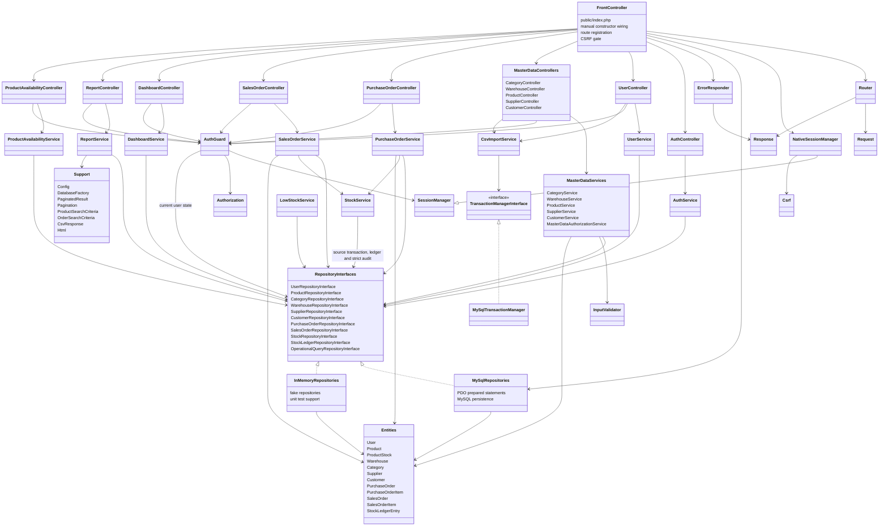
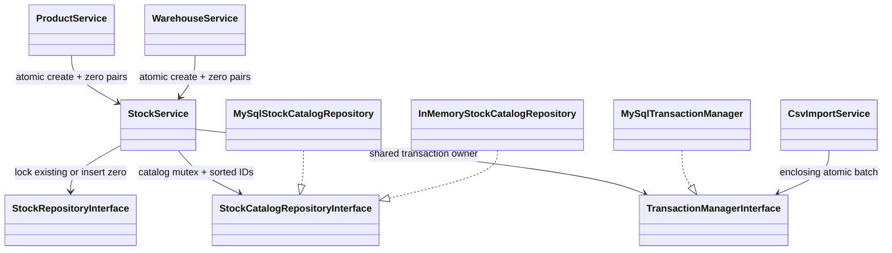

# As-Built Class Diagram

Date: 2026-08-31  
Source checked: `app/**/*.php`, `public/index.php`, `composer.json`

Management pagination update: 2026-10-06. Existing grouped layer structure retained; `Pagination` now joins the Support value objects used by Management controllers/services/repositories.

This diagram reflects the implemented native PHP architecture after Phase 6. It intentionally groups repeated CRUD classes where the dependency shape is the same.

Key evidence:

- Dependency direction is controller to service to repository interface. MySQL and in-memory repositories implement the same contracts.
- `public/index.php` is the composition root and uses manual constructor injection.
- `StockService` is the only service that begins stock transactions and writes stock ledger entries.
- `NativeSessionManager` owns PHP session persistence; controllers and services consume `AuthContext` through `AuthGuard`/`SessionManager`.
- Search and pagination criteria are value objects under `app/Support`, not SQL fragments from controllers.

Audit remediation update (6 October 2026): source-order locks precede deterministic stock locks; order, stock, ledger and critical audit share one transaction. AuthGuard resolves current users through the repository boundary. CsvImportService uses TransactionManagerInterface for atomic batches, while report preview uses repository aggregates/LIMIT and HTTP CSV streams rows. Supplier/customer/warehouse lookups are loaded only for their order routes; list stock/items use batch queries.

## Catalog balance initialization — 7 October 2026

The runtime manually injects one shared StockService/TransactionManager. Opening zero pairs generate no goods movement; existing stock/ledger deltas remain exclusively in receipt/issue transactions. FormState is presentation input recovery; it does not mutate repositories/entities. ADR-006 records the initialization mutex and import nesting behavior.
