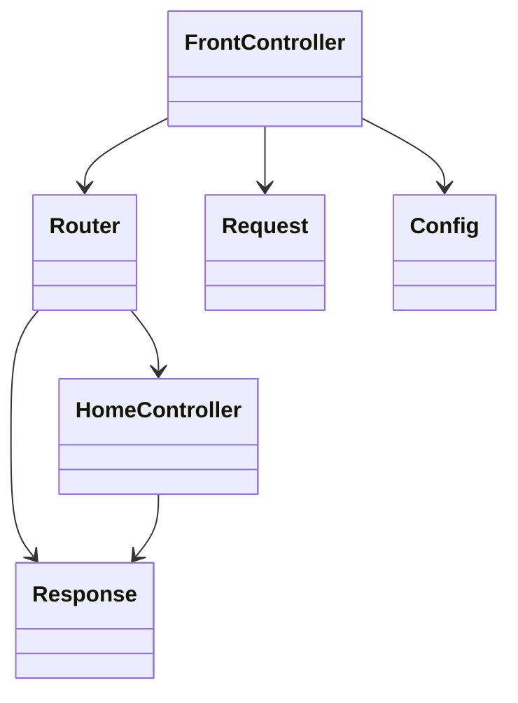

# Initial Class Diagram

```mermaid
classDiagram
    class FrontController
    class Router
    class Request
    class Response
    class HomeController
    class Config

    FrontController --> Router
    FrontController --> Request
    Router --> Response
    Router --> HomeController
    HomeController --> Response
    FrontController --> Config
```

This Phase 0 diagram covers only the bootstrap classes. The as-built diagram near release must be regenerated from actual implementation code.
