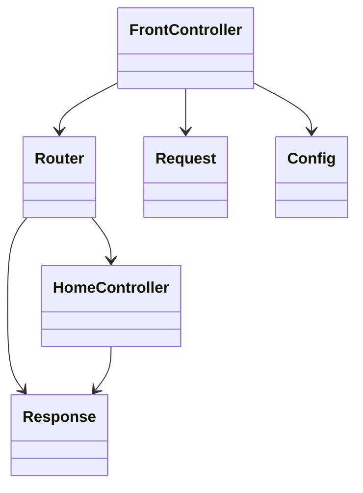

# Phase 0 Bootstrap Implementation Plan

> **For agentic workers:** REQUIRED SUB-SKILL: Use spark:subagent-driven-development (recommended) or spark:executing-plans to implement this plan task-by-task. Steps use checkbox (`- [ ]`) syntax for tracking.

**Goal:** Build the Phase 0 native PHP foundation: repository structure, Composer autoloading, Docker Compose, config/env loading, front controller/router, schema skeleton, PHPUnit/PHPStan setup, and initial evidence docs.

**Architecture:** Use a small native PHP 8.2 application with `public/index.php` as the front controller and `app/Http/Router.php` for method/path routing. Preserve the later Controller -> Service -> Repository shape by creating empty ownership directories now and keeping HTTP handling separate from configuration and response rendering.

**Tech Stack:** PHP 8.2+, Composer PSR-4, MySQL 8, PDO extension, Docker Compose, PHPUnit 10, PHPStan level 5, HTML/CSS, Vanilla JavaScript reserved for later slices.

## Global Constraints

- PHP 8.2+ Native OOP.
- MySQL 8 + PDO prepared statements.
- Controller -> Service -> Repository separation.
- Repository interface boundary with manual constructor injection.
- HTML + custom CSS + Vanilla JS + Fetch API.
- Docker Compose.
- PHPUnit unit + integration tests.
- PHPStan level 5+ preferred.
- No Laravel/CodeIgniter/Symfony/Slim/ORM/framework DI container.
- No React/Vue/Angular/jQuery/CSS framework/admin template.
- Never mutate stock outside stock service transaction + ledger.
- Never place authorization only in UI.
- Phase 0 must not implement authentication, CRUD, stock mutation, dashboard, reports, API, low-stock job, or optional enterprise features.

---

## File Structure Map

Create or modify these files during this plan:

- `.gitignore`: excludes local environment, dependencies, generated reports, runtime uploads, and OS/editor noise.
- `.env.example`: safe environment contract for app and MySQL container.
- `composer.json`: package metadata, PSR-4 autoloading, PHPUnit/PHPStan scripts.
- `phpunit.xml`: test suite configuration.
- `phpstan.neon`: static analysis configuration at level 5.
- `Dockerfile`: PHP 8.2 CLI image with `pdo_mysql`, Composer, and built-in server command.
- `compose.yaml`: app and MySQL 8 services with documented ports and env variables.
- `README.md`: Phase 0 startup and verification commands.
- `config/bootstrap.php`: loads Composer autoloading and registers error handling.
- `config/config.php`: returns environment-backed app/database configuration.
- `public/index.php`: front controller and route registration.
- `public/assets/css/app.css`: minimal baseline page styling.
- `public/assets/js/app.js`: empty strict-mode baseline for later Vanilla JS.
- `app/Controller/HomeController.php`: known route handler.
- `app/Exception/HttpException.php`: HTTP status exception.
- `app/Http/Request.php`: immutable request object from globals.
- `app/Http/Response.php`: response object with status, headers, and body sending.
- `app/Http/Router.php`: exact method/path routing and 404 behavior.
- `app/Support/Config.php`: typed config accessor.
- `database/schema-and-seed.sql`: MySQL schema/seed skeleton.
- `tests/Unit/BootstrapSmokeTest.php`: autoload/config smoke test.
- `tests/Integration/.gitkeep`: integration suite directory marker.
- `app/Service/.gitkeep`, `app/Repository/Contract/.gitkeep`, `app/Repository/MySql/.gitkeep`, `app/Repository/InMemory/.gitkeep`, `app/Entity/.gitkeep`, `app/Security/.gitkeep`, `app/Validation/.gitkeep`: architecture ownership directories for later slices.
- `views/errors/404.php`, `views/errors/500.php`, `views/layouts/.gitkeep`: baseline view/evidence directories.
- `docs/planning/scope.md`, `docs/planning/backlog.md`, `docs/planning/DECISIONS_PENDING.md`: planning evidence.
- `docs/architecture/class-diagram-initial.md`, `docs/architecture/adr-001-layered-repository.md`, `docs/architecture/adr-002-stock-concurrency.md`: architecture evidence.
- `docs/quality/tech-debt.md`: quality evidence.
- `docs/testing/test-scenarios.md`: testing evidence.
- `ai-usage-log.md`: AI usage disclosure log.

---

### Task 1: Repository Metadata and Composer Baseline

**Files:**
- Create: `.gitignore`
- Create: `composer.json`
- Create: `README.md`
- Create directories: `app/Controller`, `app/Exception`, `app/Http`, `app/Support`, `app/Service`, `app/Repository/Contract`, `app/Repository/MySql`, `app/Repository/InMemory`, `app/Entity`, `app/Security`, `app/Validation`, `config`, `public/assets/css`, `public/assets/js`, `database`, `tests/Unit`, `tests/Integration`, `views/errors`, `views/layouts`
- Create: `.gitkeep` files in empty architecture directories

**Interfaces:**
- Consumes: approved Phase 0 spec at `docs/planning/specs/phase-0-bootstrap.md`.
- Produces: Composer PSR-4 namespace `App\\` mapped to `app/`; test namespace `Tests\\` mapped to `tests/`.

- [ ] **Step 1: Create the directory structure**

Run:

```bash
mkdir -p app/Controller app/Exception app/Http app/Support app/Service app/Repository/Contract app/Repository/MySql app/Repository/InMemory app/Entity app/Security app/Validation config public/assets/css public/assets/js database tests/Unit tests/Integration views/errors views/layouts
touch app/Service/.gitkeep app/Repository/Contract/.gitkeep app/Repository/MySql/.gitkeep app/Repository/InMemory/.gitkeep app/Entity/.gitkeep app/Security/.gitkeep app/Validation/.gitkeep tests/Integration/.gitkeep views/layouts/.gitkeep
```

Expected: directories exist; command exits with status 0.

- [ ] **Step 2: Create `.gitignore`**

Write:

```gitignore
/.env
/vendor/
/var/
/coverage/
/docs/quality/phpstan-report.txt
/public/uploads/

.DS_Store
.idea/
.vscode/
*.log
```

- [ ] **Step 3: Create `composer.json`**

Write:

```json
{
  "name": "assessment/inventory-order-management",
  "description": "Native PHP inventory and order management system for final assessment.",
  "type": "project",
  "require": {
    "php": "^8.2",
    "ext-pdo": "*"
  },
  "require-dev": {
    "phpunit/phpunit": "^10.5",
    "phpstan/phpstan": "^1.11"
  },
  "autoload": {
    "psr-4": {
      "App\\\\": "app/"
    }
  },
  "autoload-dev": {
    "psr-4": {
      "Tests\\\\": "tests/"
    }
  },
  "scripts": {
    "test": "phpunit",
    "test:unit": "phpunit --testsuite Unit",
    "test:integration": "phpunit --testsuite Integration",
    "analyse": "phpstan analyse --memory-limit=256M"
  },
  "config": {
    "sort-packages": true
  }
}
```

- [ ] **Step 4: Create `README.md`**

Write:

```markdown
# Inventory & Order Management System

Native PHP 8.2+ inventory and order management system for the final project assessment.

## Phase 0 Commands

Install dependencies:

```bash
composer install
```

Run tests:

```bash
composer test
```

Run static analysis:

```bash
composer analyse
```

Start Docker services:

```bash
docker compose up --build
```

Application URL:

```text
http://localhost:8080
```

## Environment

Copy `.env.example` to `.env` for local development. Keep `.env` out of source control.
```

- [ ] **Step 5: Install dependencies**

Run:

```bash
composer install
```

Expected: `vendor/autoload.php` and `composer.lock` are created; command exits with status 0. If network access is blocked, record that dependency installation requires network approval and continue only after approval.

- [ ] **Step 6: Verify Composer metadata**

Run:

```bash
composer validate --strict
composer dump-autoload
```

Expected: Composer reports valid metadata and regenerates autoload files.

- [ ] **Step 7: Commit checkpoint when Git exists**

Run:

```bash
git status --short
```

Expected if Git is initialized: changed files are listed. Commit with:

```bash
git add .gitignore composer.json composer.lock README.md app config public database tests views
git commit -m "chore: bootstrap repository structure"
```

Expected if Git is not initialized: `fatal: not a git repository`; record this in the task report and skip the commit.

---

### Task 2: Environment Configuration

**Files:**
- Create: `.env.example`
- Create: `app/Support/Config.php`
- Create: `config/config.php`
- Create: `config/bootstrap.php`
- Test: `tests/Unit/BootstrapSmokeTest.php`

**Interfaces:**
- Consumes: Composer autoload from Task 1.
- Produces: `App\Support\Config::__construct(array $values)`, `Config::string(string $key): string`, `Config::int(string $key): int`, `Config::bool(string $key): bool`.

- [ ] **Step 1: Write failing config smoke test**

Create `tests/Unit/BootstrapSmokeTest.php`:

```php
<?php

declare(strict_types=1);

namespace Tests\Unit;

use App\Support\Config;
use PHPUnit\Framework\TestCase;

final class BootstrapSmokeTest extends TestCase
{
    public function testConfigReturnsTypedValues(): void
    {
        $config = new Config([
            'APP_NAME' => 'Inventory Test',
            'APP_PORT' => '8080',
            'APP_DEBUG' => 'true',
        ]);

        self::assertSame('Inventory Test', $config->string('APP_NAME'));
        self::assertSame(8080, $config->int('APP_PORT'));
        self::assertTrue($config->bool('APP_DEBUG'));
    }

    public function testConfigFailsForMissingKey(): void
    {
        $config = new Config([]);

        $this->expectException(\InvalidArgumentException::class);
        $this->expectExceptionMessage('Missing configuration value: APP_NAME');

        $config->string('APP_NAME');
    }
}
```

- [ ] **Step 2: Add PHPUnit config before running the test**

Create `phpunit.xml`:

```xml
<?xml version="1.0" encoding="UTF-8"?>
<phpunit xmlns:xsi="http://www.w3.org/2001/XMLSchema-instance"
         xsi:noNamespaceSchemaLocation="https://schema.phpunit.de/10.5/phpunit.xsd"
         bootstrap="vendor/autoload.php"
         colors="true"
         cacheDirectory=".phpunit.cache">
    <testsuites>
        <testsuite name="Unit">
            <directory>tests/Unit</directory>
        </testsuite>
        <testsuite name="Integration">
            <directory>tests/Integration</directory>
        </testsuite>
    </testsuites>
</phpunit>
```

- [ ] **Step 3: Run test to verify it fails**

Run:

```bash
composer test -- --filter BootstrapSmokeTest
```

Expected: FAIL because `App\Support\Config` does not exist.

- [ ] **Step 4: Create `app/Support/Config.php`**

Write:

```php
<?php

declare(strict_types=1);

namespace App\Support;

final class Config
{
    /**
     * @param array<string, mixed> $values
     */
    public function __construct(private readonly array $values)
    {
    }

    public function string(string $key): string
    {
        $value = $this->value($key);

        if (!is_scalar($value)) {
            throw new \InvalidArgumentException("Configuration value must be scalar: {$key}");
        }

        return (string) $value;
    }

    public function int(string $key): int
    {
        $value = $this->string($key);

        if (!preg_match('/^-?\d+$/', $value)) {
            throw new \InvalidArgumentException("Configuration value must be an integer: {$key}");
        }

        return (int) $value;
    }

    public function bool(string $key): bool
    {
        $value = strtolower($this->string($key));

        return match ($value) {
            '1', 'true', 'yes', 'on' => true,
            '0', 'false', 'no', 'off' => false,
            default => throw new \InvalidArgumentException("Configuration value must be boolean: {$key}"),
        };
    }

    private function value(string $key): mixed
    {
        if (!array_key_exists($key, $this->values) || $this->values[$key] === '') {
            throw new \InvalidArgumentException("Missing configuration value: {$key}");
        }

        return $this->values[$key];
    }
}
```

- [ ] **Step 5: Create `.env.example`**

Write:

```dotenv
APP_NAME="Inventory & Order Management"
APP_ENV=local
APP_DEBUG=true
APP_PORT=8080

DB_HOST=db
DB_PORT=3306
DB_DATABASE=inventory_order_management
DB_USERNAME=inventory_app
DB_PASSWORD=change_me_for_local_only
DB_ROOT_PASSWORD=change_me_root_for_local_only
```

- [ ] **Step 6: Create `config/config.php`**

Write:

```php
<?php

declare(strict_types=1);

use App\Support\Config;

return new Config([
    'APP_NAME' => $_ENV['APP_NAME'] ?? getenv('APP_NAME') ?: 'Inventory & Order Management',
    'APP_ENV' => $_ENV['APP_ENV'] ?? getenv('APP_ENV') ?: 'local',
    'APP_DEBUG' => $_ENV['APP_DEBUG'] ?? getenv('APP_DEBUG') ?: 'false',
    'APP_PORT' => $_ENV['APP_PORT'] ?? getenv('APP_PORT') ?: '8080',
    'DB_HOST' => $_ENV['DB_HOST'] ?? getenv('DB_HOST') ?: 'db',
    'DB_PORT' => $_ENV['DB_PORT'] ?? getenv('DB_PORT') ?: '3306',
    'DB_DATABASE' => $_ENV['DB_DATABASE'] ?? getenv('DB_DATABASE') ?: '',
    'DB_USERNAME' => $_ENV['DB_USERNAME'] ?? getenv('DB_USERNAME') ?: '',
    'DB_PASSWORD' => $_ENV['DB_PASSWORD'] ?? getenv('DB_PASSWORD') ?: '',
]);
```

- [ ] **Step 7: Create `config/bootstrap.php`**

Write:

```php
<?php

declare(strict_types=1);

use App\Support\Config;

require_once dirname(__DIR__) . '/vendor/autoload.php';

error_reporting(E_ALL);

/** @var Config $config */
$config = require __DIR__ . '/config.php';

ini_set('display_errors', $config->bool('APP_DEBUG') ? '1' : '0');

set_exception_handler(static function (Throwable $throwable) use ($config): void {
    http_response_code(500);
    $message = $config->bool('APP_DEBUG')
        ? htmlspecialchars($throwable->getMessage(), ENT_QUOTES, 'UTF-8')
        : 'Unexpected server error.';

    echo '<!doctype html><html lang="en"><meta charset="utf-8"><title>Server Error</title>';
    echo '<body><h1>Server Error</h1><p>' . $message . '</p></body></html>';
});

return $config;
```

- [ ] **Step 8: Run test to verify it passes**

Run:

```bash
composer test -- --filter BootstrapSmokeTest
```

Expected: PASS with 2 tests.

- [ ] **Step 9: Commit checkpoint when Git exists**

Run:

```bash
git status --short
```

Expected if Git is initialized: changed files are listed. Commit with:

```bash
git add .env.example app/Support/Config.php config/config.php config/bootstrap.php phpunit.xml tests/Unit/BootstrapSmokeTest.php
git commit -m "chore: add environment configuration"
```

Expected if Git is not initialized: record the missing Git repository in the task report.

---

### Task 3: HTTP Front Controller and Router

**Files:**
- Create: `app/Exception/HttpException.php`
- Create: `app/Http/Request.php`
- Create: `app/Http/Response.php`
- Create: `app/Http/Router.php`
- Create: `app/Controller/HomeController.php`
- Create: `public/index.php`
- Create: `public/assets/css/app.css`
- Create: `public/assets/js/app.js`
- Test: `tests/Unit/RouterTest.php`

**Interfaces:**
- Consumes: `Config` from Task 2.
- Produces: `Request::fromGlobals(): Request`, `Response::html(string $body, int $status = 200): Response`, `Router::get(string $path, callable $handler): void`, `Router::dispatch(Request $request): Response`.

- [ ] **Step 1: Write failing router test**

Create `tests/Unit/RouterTest.php`:

```php
<?php

declare(strict_types=1);

namespace Tests\Unit;

use App\Exception\HttpException;
use App\Http\Request;
use App\Http\Response;
use App\Http\Router;
use PHPUnit\Framework\TestCase;

final class RouterTest extends TestCase
{
    public function testDispatchesMatchingGetRoute(): void
    {
        $router = new Router();
        $router->get('/', static fn (Request $request): Response => Response::html('ok'));

        $response = $router->dispatch(new Request('GET', '/', [], [], []));

        self::assertSame(200, $response->statusCode());
        self::assertSame('ok', $response->body());
    }

    public function testUnknownRouteThrowsHttp404(): void
    {
        $router = new Router();

        $this->expectException(HttpException::class);
        $this->expectExceptionMessage('Route not found.');

        $router->dispatch(new Request('GET', '/missing', [], [], []));
    }
}
```

- [ ] **Step 2: Run test to verify it fails**

Run:

```bash
composer test -- --filter RouterTest
```

Expected: FAIL because HTTP classes do not exist.

- [ ] **Step 3: Create `app/Exception/HttpException.php`**

Write:

```php
<?php

declare(strict_types=1);

namespace App\Exception;

final class HttpException extends \RuntimeException
{
    public function __construct(private readonly int $statusCode, string $message)
    {
        parent::__construct($message);
    }

    public function statusCode(): int
    {
        return $this->statusCode;
    }
}
```

- [ ] **Step 4: Create `app/Http/Request.php`**

Write:

```php
<?php

declare(strict_types=1);

namespace App\Http;

final class Request
{
    /**
     * @param array<string, string> $query
     * @param array<string, mixed> $post
     * @param array<string, mixed> $server
     */
    public function __construct(
        private readonly string $method,
        private readonly string $path,
        private readonly array $query,
        private readonly array $post,
        private readonly array $server,
    ) {
    }

    public static function fromGlobals(): self
    {
        $uri = (string) ($_SERVER['REQUEST_URI'] ?? '/');
        $path = parse_url($uri, PHP_URL_PATH);

        return new self(
            strtoupper((string) ($_SERVER['REQUEST_METHOD'] ?? 'GET')),
            is_string($path) && $path !== '' ? $path : '/',
            $_GET,
            $_POST,
            $_SERVER,
        );
    }

    public function method(): string
    {
        return $this->method;
    }

    public function path(): string
    {
        return $this->path;
    }

    /**
     * @return array<string, string>
     */
    public function query(): array
    {
        return $this->query;
    }

    /**
     * @return array<string, mixed>
     */
    public function post(): array
    {
        return $this->post;
    }

    /**
     * @return array<string, mixed>
     */
    public function server(): array
    {
        return $this->server;
    }
}
```

- [ ] **Step 5: Create `app/Http/Response.php`**

Write:

```php
<?php

declare(strict_types=1);

namespace App\Http;

final class Response
{
    /**
     * @param array<string, string> $headers
     */
    public function __construct(
        private readonly string $body,
        private readonly int $statusCode = 200,
        private readonly array $headers = ['Content-Type' => 'text/html; charset=UTF-8'],
    ) {
    }

    public static function html(string $body, int $status = 200): self
    {
        return new self($body, $status);
    }

    public function send(): void
    {
        http_response_code($this->statusCode);

        foreach ($this->headers as $name => $value) {
            header($name . ': ' . $value);
        }

        echo $this->body;
    }

    public function body(): string
    {
        return $this->body;
    }

    public function statusCode(): int
    {
        return $this->statusCode;
    }

    /**
     * @return array<string, string>
     */
    public function headers(): array
    {
        return $this->headers;
    }
}
```

- [ ] **Step 6: Create `app/Http/Router.php`**

Write:

```php
<?php

declare(strict_types=1);

namespace App\Http;

use App\Exception\HttpException;

final class Router
{
    /** @var array<string, callable(Request): Response> */
    private array $routes = [];

    /**
     * @param callable(Request): Response $handler
     */
    public function get(string $path, callable $handler): void
    {
        $this->add('GET', $path, $handler);
    }

    /**
     * @param callable(Request): Response $handler
     */
    public function post(string $path, callable $handler): void
    {
        $this->add('POST', $path, $handler);
    }

    public function dispatch(Request $request): Response
    {
        $key = $this->key($request->method(), $request->path());

        if (!isset($this->routes[$key])) {
            throw new HttpException(404, 'Route not found.');
        }

        return ($this->routes[$key])($request);
    }

    /**
     * @param callable(Request): Response $handler
     */
    private function add(string $method, string $path, callable $handler): void
    {
        $this->routes[$this->key($method, $path)] = $handler;
    }

    private function key(string $method, string $path): string
    {
        return strtoupper($method) . ' ' . $path;
    }
}
```

- [ ] **Step 7: Create `app/Controller/HomeController.php`**

Write:

```php
<?php

declare(strict_types=1);

namespace App\Controller;

use App\Http\Request;
use App\Http\Response;

final class HomeController
{
    public function index(Request $request): Response
    {
        $body = <<<'HTML'
<!doctype html>
<html lang="en">
<head>
    <meta charset="utf-8">
    <meta name="viewport" content="width=device-width, initial-scale=1">
    <title>Inventory & Order Management</title>
    <link rel="stylesheet" href="/assets/css/app.css">
    <script defer src="/assets/js/app.js"></script>
</head>
<body>
    <main class="page">
        <h1>Inventory & Order Management</h1>
        <p>Phase 0 bootstrap is running.</p>
    </main>
</body>
</html>
HTML;

        return Response::html($body);
    }
}
```

- [ ] **Step 8: Create `public/index.php`**

Write:

```php
<?php

declare(strict_types=1);

use App\Controller\HomeController;
use App\Exception\HttpException;
use App\Http\Request;
use App\Http\Response;
use App\Http\Router;

require dirname(__DIR__) . '/config/bootstrap.php';

$router = new Router();
$homeController = new HomeController();

$router->get('/', [$homeController, 'index']);

try {
    $response = $router->dispatch(Request::fromGlobals());
} catch (HttpException $exception) {
    $message = htmlspecialchars($exception->getMessage(), ENT_QUOTES, 'UTF-8');
    $response = Response::html(
        '<!doctype html><html lang="en"><meta charset="utf-8"><title>Not Found</title><body><h1>Not Found</h1><p>' . $message . '</p></body></html>',
        $exception->statusCode()
    );
}

$response->send();
```

- [ ] **Step 9: Create baseline assets**

Create `public/assets/css/app.css`:

```css
* {
    box-sizing: border-box;
}

body {
    margin: 0;
    font-family: Arial, sans-serif;
    color: #1f2933;
    background: #f5f7fa;
}

.page {
    width: min(960px, calc(100% - 32px));
    margin: 48px auto;
    padding: 24px;
    background: #ffffff;
    border: 1px solid #d9e2ec;
}
```

Create `public/assets/js/app.js`:

```javascript
'use strict';
```

- [ ] **Step 10: Run router tests**

Run:

```bash
composer test -- --filter RouterTest
```

Expected: PASS with 2 tests.

- [ ] **Step 11: Run local PHP server smoke check**

Run:

```bash
php -S 127.0.0.1:8080 -t public
```

Expected: server starts and logs `Development Server (http://127.0.0.1:8080) started`. In another terminal, run:

```bash
curl -i http://127.0.0.1:8080/
curl -i http://127.0.0.1:8080/missing
```

Expected: `/` returns HTTP 200 with `Phase 0 bootstrap is running.`; `/missing` returns HTTP 404.

- [ ] **Step 12: Commit checkpoint when Git exists**

Run:

```bash
git status --short
```

Expected if Git is initialized: changed files are listed. Commit with:

```bash
git add app/Controller app/Exception app/Http public tests/Unit/RouterTest.php
git commit -m "feat: add front controller router baseline"
```

Expected if Git is not initialized: record the missing Git repository in the task report.

---

### Task 4: Docker Compose Runtime

**Files:**
- Create: `Dockerfile`
- Create: `compose.yaml`
- Modify: `README.md`

**Interfaces:**
- Consumes: `public/index.php` from Task 3 and `.env.example` from Task 2.
- Produces: app service reachable at `http://localhost:8080`; MySQL 8 service named `db`.

- [ ] **Step 1: Create `Dockerfile`**

Write:

```dockerfile
FROM php:8.2-cli

RUN docker-php-ext-install pdo_mysql

COPY --from=composer:2 /usr/bin/composer /usr/bin/composer

WORKDIR /var/www/html

COPY composer.json composer.lock* ./
RUN composer install --no-interaction --prefer-dist

COPY . .

EXPOSE 8080

CMD ["php", "-S", "0.0.0.0:8080", "-t", "public"]
```

- [ ] **Step 2: Create `compose.yaml`**

Write:

```yaml
services:
  app:
    build:
      context: .
    ports:
      - "${APP_PORT:-8080}:8080"
    environment:
      APP_NAME: "${APP_NAME:-Inventory & Order Management}"
      APP_ENV: "${APP_ENV:-local}"
      APP_DEBUG: "${APP_DEBUG:-true}"
      APP_PORT: "${APP_PORT:-8080}"
      DB_HOST: db
      DB_PORT: 3306
      DB_DATABASE: "${DB_DATABASE:-inventory_order_management}"
      DB_USERNAME: "${DB_USERNAME:-inventory_app}"
      DB_PASSWORD: "${DB_PASSWORD:-change_me_for_local_only}"
    depends_on:
      db:
        condition: service_healthy
    volumes:
      - .:/var/www/html

  db:
    image: mysql:8.0
    ports:
      - "3306:3306"
    environment:
      MYSQL_DATABASE: "${DB_DATABASE:-inventory_order_management}"
      MYSQL_USER: "${DB_USERNAME:-inventory_app}"
      MYSQL_PASSWORD: "${DB_PASSWORD:-change_me_for_local_only}"
      MYSQL_ROOT_PASSWORD: "${DB_ROOT_PASSWORD:-change_me_root_for_local_only}"
    healthcheck:
      test: ["CMD", "mysqladmin", "ping", "-h", "localhost"]
      interval: 5s
      timeout: 5s
      retries: 20
    volumes:
      - mysql-data:/var/lib/mysql
      - ./database/schema-and-seed.sql:/docker-entrypoint-initdb.d/001-schema-and-seed.sql:ro

volumes:
  mysql-data:
```

- [ ] **Step 3: Update `README.md` Docker section**

Ensure `README.md` contains:

```markdown
## Docker

Start the application and database:

```bash
docker compose up --build
```

Open:

```text
http://localhost:8080
```

The `db` service runs MySQL 8 and loads `database/schema-and-seed.sql` on first volume initialization.
```

- [ ] **Step 4: Run Docker config validation**

Run:

```bash
docker compose config
```

Expected: compose file renders with services `app` and `db`; command exits with status 0.

- [ ] **Step 5: Run Docker boot check**

Run:

```bash
docker compose up --build
```

Expected: `db` becomes healthy; `app` starts PHP built-in server on port 8080.

- [ ] **Step 6: Verify app route through Docker**

Run:

```bash
curl -i http://localhost:8080/
```

Expected: HTTP 200 and body contains `Phase 0 bootstrap is running.`

- [ ] **Step 7: Stop Docker services**

Run:

```bash
docker compose down
```

Expected: services stop; named volume remains for local reuse.

- [ ] **Step 8: Commit checkpoint when Git exists**

Run:

```bash
git status --short
```

Expected if Git is initialized: changed files are listed. Commit with:

```bash
git add Dockerfile compose.yaml README.md
git commit -m "chore: add docker compose runtime"
```

Expected if Git is not initialized: record the missing Git repository in the task report.

---

### Task 5: Database Skeleton

**Files:**
- Create: `database/schema-and-seed.sql`
- Modify: `docs/planning/DECISIONS_PENDING.md` if Phase 0 runtime decisions are recorded in Task 7 first

**Interfaces:**
- Consumes: MySQL 8 service from Task 4.
- Produces: executable SQL file loaded by Docker on first database volume initialization.

- [ ] **Step 1: Create `database/schema-and-seed.sql`**

Write:

```sql
-- Inventory & Order Management System
-- Phase 0 schema and seed baseline.
-- Later phases add users, master data, purchase orders, sales orders, product stock, and stock ledger tables.

CREATE DATABASE IF NOT EXISTS inventory_order_management
    CHARACTER SET utf8mb4
    COLLATE utf8mb4_unicode_ci;

USE inventory_order_management;

CREATE TABLE IF NOT EXISTS schema_versions (
    id INT UNSIGNED AUTO_INCREMENT PRIMARY KEY,
    version VARCHAR(50) NOT NULL UNIQUE,
    description VARCHAR(255) NOT NULL,
    applied_at TIMESTAMP NOT NULL DEFAULT CURRENT_TIMESTAMP
) ENGINE=InnoDB;

INSERT INTO schema_versions (version, description)
VALUES ('phase-0', 'Bootstrap schema baseline')
ON DUPLICATE KEY UPDATE description = VALUES(description);
```

- [ ] **Step 2: Validate SQL through Docker MySQL**

Run:

```bash
docker compose up -d db
docker compose exec db mysql -uinventory_app -pchange_me_for_local_only inventory_order_management -e "SELECT version, description FROM schema_versions;"
```

Expected: one row with `phase-0` and `Bootstrap schema baseline`.

- [ ] **Step 3: Stop Docker service**

Run:

```bash
docker compose down
```

Expected: service stops cleanly.

- [ ] **Step 4: Commit checkpoint when Git exists**

Run:

```bash
git status --short
```

Expected if Git is initialized: changed files are listed. Commit with:

```bash
git add database/schema-and-seed.sql
git commit -m "chore: add database skeleton"
```

Expected if Git is not initialized: record the missing Git repository in the task report.

---

### Task 6: Static Analysis Baseline

**Files:**
- Create: `phpstan.neon`
- Modify: `README.md`
- Create directory: `docs/quality`

**Interfaces:**
- Consumes: PHP source files from Tasks 2 and 3.
- Produces: Composer script `composer analyse` that runs PHPStan level 5 over `app`, `config`, and `public`.

- [ ] **Step 1: Create `phpstan.neon`**

Write:

```neon
parameters:
    level: 5
    paths:
        - app
        - config
        - public
    tmpDir: var/phpstan
```

- [ ] **Step 2: Ensure quality directory exists**

Run:

```bash
mkdir -p docs/quality var
```

Expected: directories exist.

- [ ] **Step 3: Run static analysis**

Run:

```bash
composer analyse
```

Expected: PHPStan completes with no errors. If it reports an issue, fix the exact reported file and rerun until clean.

- [ ] **Step 4: Capture static analysis evidence**

Run:

```bash
composer analyse > docs/quality/phpstan-report.txt
```

Expected: `docs/quality/phpstan-report.txt` contains a successful PHPStan result.

- [ ] **Step 5: Update `README.md` quality command section**

Ensure `README.md` contains:

```markdown
## Quality Checks

```bash
composer test
composer analyse
```

Static analysis evidence is stored in `docs/quality/phpstan-report.txt` when release evidence is refreshed.
```

- [ ] **Step 6: Commit checkpoint when Git exists**

Run:

```bash
git status --short
```

Expected if Git is initialized: changed files are listed. Commit with:

```bash
git add phpstan.neon README.md docs/quality/phpstan-report.txt
git commit -m "chore: add static analysis baseline"
```

Expected if Git is not initialized: record the missing Git repository in the task report.

---

### Task 7: Evidence Documents

**Files:**
- Create: `docs/planning/scope.md`
- Create: `docs/planning/backlog.md`
- Create: `docs/planning/DECISIONS_PENDING.md`
- Create: `docs/architecture/class-diagram-initial.md`
- Create: `docs/architecture/adr-001-layered-repository.md`
- Create: `docs/architecture/adr-002-stock-concurrency.md`
- Create: `docs/quality/tech-debt.md`
- Create: `docs/testing/test-scenarios.md`
- Create: `ai-usage-log.md`

**Interfaces:**
- Consumes: `SDD.md`, `PLAN.md`, `docs/planning/CONSTITUTION.md`, and Phase 0 spec.
- Produces: evidence files required by Phase 0 and later quality gates.

- [ ] **Step 1: Create evidence directories**

Run:

```bash
mkdir -p docs/architecture docs/quality docs/testing docs/planning
```

Expected: directories exist.

- [ ] **Step 2: Create `docs/planning/scope.md`**

Write:

```markdown
# Scope

## Mandatory Scope

The project implements the Inventory & Order Management System described by the official final project brief and translated into `SDD.md`.

Mandatory capabilities include authentication, user management, master data, multi-warehouse stock, Purchase Orders with receipt, Sales Orders with approval and goods issue, stock ledger, search/filter/sort/pagination, role dashboards, CSV reports, one JSON API, validation, safe errors, responsive UI, Docker, PHPUnit tests, integration tests, static analysis, and architecture evidence.

## Phase 0 Scope

Phase 0 creates the technical foundation only: repository structure, Composer autoloading, Docker Compose, config, front controller, router, schema baseline, test tooling, static analysis, and evidence folders.

## Excluded Until Mandatory Green

Optional enterprise features are deferred until mandatory requirements pass tests, static analysis is acceptable, Docker boot is verified, and evidence is complete.
```

- [ ] **Step 3: Create `docs/planning/backlog.md`**

Write:

```markdown
# Backlog

## Phase 0 - Bootstrap and Evidence Baseline

- Create repository structure.
- Configure Composer PSR-4 autoloading.
- Configure PHPUnit and PHPStan.
- Add Dockerfile and compose.yaml.
- Add `.env.example` and config loader.
- Add front controller, router, and safe error baseline.
- Add database schema and seed skeleton.
- Add initial evidence documents.
- Verify Composer, tests, static analysis, and Docker boot.

## Later Mandatory Phases

- Phase 1: Authentication and authorization.
- Phase 2: Master data and multi-warehouse stock.
- Phase 3: Purchase Order receipt.
- Phase 4: Sales Order approval and goods issue.
- Phase 5: Lists, dashboard, reports, API, and low-stock job.
- Phase 6: UI, validation, security, and error handling.
- Phase 7: Design and quality evidence.
- Phase 8: Release hardening.
```

- [ ] **Step 4: Create `docs/planning/DECISIONS_PENDING.md`**

Write:

```markdown
# Pending Decisions

## Phase 0

- Local app port default: 8080.
- PHP runtime baseline: PHP 8.2 CLI with built-in server for assessment bootstrap.
- Composer scripts: `test`, `test:unit`, `test:integration`, `analyse`.

## Later Phases

- PO cancellation rules after partial receipt.
- Admin-created Sales Order self-approval policy.
- Multi-warehouse low-stock dashboard semantics.
- Exact order-number format.
- Duplicate item line behavior: reject or merge.
- Sales Order rejection representation.
- Transaction ownership: direct PDO transaction in service or dedicated transaction manager.
```

- [ ] **Step 5: Create `docs/architecture/class-diagram-initial.md`**

Write:

```markdown
# Initial Class Diagram



This Phase 0 diagram covers only the bootstrap classes. The as-built diagram near release must be regenerated from actual implementation code.
```

- [ ] **Step 6: Create `docs/architecture/adr-001-layered-repository.md`**

Write:

```markdown
# ADR-001: Layered Controller-Service-Repository Boundary

Status: Accepted  
Date: 2026-08-31

## Context

The assessment requires native PHP OOP, repository interface boundaries, manual constructor injection, unit tests, and no framework DI container or ORM.

## Decision

Use Controller -> Service -> Repository separation. Services depend on repository interfaces. MySQL repositories use PDO prepared statements. InMemory repositories support unit tests. Dependencies are wired manually at the composition root.

## Consequences

Business logic stays testable without MySQL. More files are required, but ownership boundaries are explicit and defensible.
```

- [ ] **Step 7: Create `docs/architecture/adr-002-stock-concurrency.md`**

Write:

```markdown
# ADR-002: Stock Concurrency Through MySQL Row Locks

Status: Accepted  
Date: 2026-08-31

## Context

Concurrent goods receipt or goods issue can corrupt inventory if stock rows are read and updated without serialization.

## Decision

Every stock mutation will run in a database transaction, lock relevant `product_stocks` rows with `SELECT ... FOR UPDATE`, validate quantity after locking, update stock, append `stock_ledger`, update the source operation state, and commit atomically.

Multiple stock rows will be locked in deterministic `(warehouse_id, product_id)` order.

## Consequences

Competing stock operations serialize per stock row. Oversell is prevented by MySQL/InnoDB row locking. All stock-changing workflows must use the stock service and ledger path.
```

- [ ] **Step 8: Create `docs/quality/tech-debt.md`**

Write:

```markdown
# Technical Debt Register

## Open Items

| ID | Area | Debt | Impact | Planned Action |
|---|---|---|---|---|
| TD-001 | Repository setup | Git repository is not initialized in the current workspace. | Commit-based evidence cannot be produced here. | Initialize Git or move project into a Git repository before release evidence is finalized. |
| TD-002 | Brief verification | Official PDF text extraction was unavailable during initial planning. | The SDD is used as the implementation-ready translation. | Re-check against the official brief when PDF tooling or extracted text is available. |
```

- [ ] **Step 9: Create `docs/testing/test-scenarios.md`**

Write:

```markdown
# Test Scenarios

## Phase 0

| Scenario | Command | Expected Result |
|---|---|---|
| Composer autoload smoke | `composer test -- --filter BootstrapSmokeTest` | PHPUnit passes config/autoload checks. |
| Router unit behavior | `composer test -- --filter RouterTest` | Known route returns 200; missing route raises 404. |
| Static analysis | `composer analyse` | PHPStan level 5 completes without errors. |
| Docker boot | `docker compose up --build` | App and MySQL services start. |
| App HTTP response | `curl -i http://localhost:8080/` | HTTP 200 with Phase 0 bootstrap message. |
```

- [ ] **Step 10: Create `ai-usage-log.md`**

Write:

```markdown
# AI Usage Log

| Date | Tool/Agent | Purpose | Human Review | Verification |
|---|---|---|---|---|
| 2026-08-31 | Codex | Created constitution, Phase 0 specification, and Phase 0 implementation plan from `AGENTS.md`, `SDD.md`, and `PLAN.md`. | User approved Phase 0 spec direction before writing. | Planning artifacts self-reviewed for scope and unresolved markers. |
```

- [ ] **Step 11: Commit checkpoint when Git exists**

Run:

```bash
git status --short
```

Expected if Git is initialized: changed files are listed. Commit with:

```bash
git add docs ai-usage-log.md
git commit -m "docs: add phase 0 evidence baseline"
```

Expected if Git is not initialized: record the missing Git repository in the task report.

---

### Task 8: Full Phase 0 Verification

**Files:**
- Modify: `docs/testing/test-scenarios.md`
- Modify: `docs/quality/phpstan-report.txt`
- Modify: `ai-usage-log.md`

**Interfaces:**
- Consumes: all deliverables from Tasks 1-7.
- Produces: verified Phase 0 evidence and a final task report.

- [ ] **Step 1: Run Composer install**

Run:

```bash
composer install
```

Expected: dependencies install from `composer.lock` and command exits with status 0.

- [ ] **Step 2: Run all tests**

Run:

```bash
composer test
```

Expected: PHPUnit passes all Unit and Integration suites. Integration suite may contain no tests in Phase 0.

- [ ] **Step 3: Run unit tests explicitly**

Run:

```bash
composer test:unit
```

Expected: `BootstrapSmokeTest` and `RouterTest` pass.

- [ ] **Step 4: Run integration test suite explicitly**

Run:

```bash
composer test:integration
```

Expected: PHPUnit reports no integration failures. If PHPUnit treats an empty integration suite as an error, add `tests/Integration/IntegrationBootstrapTest.php` with:

```php
<?php

declare(strict_types=1);

namespace Tests\Integration;

use PHPUnit\Framework\TestCase;

final class IntegrationBootstrapTest extends TestCase
{
    public function testIntegrationSuiteIsConfigured(): void
    {
        self::assertTrue(true);
    }
}
```

Then rerun `composer test:integration` and expect PASS.

- [ ] **Step 5: Run static analysis and refresh report**

Run:

```bash
composer analyse > docs/quality/phpstan-report.txt
```

Expected: command exits with status 0 and report records a successful PHPStan run.

- [ ] **Step 6: Run Docker config validation**

Run:

```bash
docker compose config
```

Expected: services `app` and `db` render correctly.

- [ ] **Step 7: Run Docker boot**

Run:

```bash
docker compose up --build
```

Expected: MySQL healthcheck passes and PHP server listens on `0.0.0.0:8080`.

- [ ] **Step 8: Verify HTTP response**

Run in a second terminal while Docker is running:

```bash
curl -i http://localhost:8080/
curl -i http://localhost:8080/missing
```

Expected: `/` returns HTTP 200 with `Phase 0 bootstrap is running.`; `/missing` returns HTTP 404 with safe text.

- [ ] **Step 9: Stop Docker services**

Run:

```bash
docker compose down
```

Expected: containers stop cleanly.

- [ ] **Step 10: Update `docs/testing/test-scenarios.md` with final command results**

Append:

```markdown
## Phase 0 Verification Results

| Command | Result | Notes |
|---|---|---|
| `composer install` | Pass | Dependencies installed. |
| `composer test` | Pass | Unit tests passed; integration suite configured. |
| `composer analyse` | Pass | PHPStan level 5 completed. |
| `docker compose config` | Pass | Compose configuration valid. |
| `docker compose up --build` | Pass | App and MySQL started. |
| `curl -i http://localhost:8080/` | Pass | App returned HTTP 200. |
```

If any command fails, record `Fail` and the exact failure reason instead of writing `Pass`.

- [ ] **Step 11: Update `ai-usage-log.md`**

Append a row:

```markdown
| 2026-08-31 | Codex | Implemented Phase 0 bootstrap artifacts. | Developer reviewed generated files and command output. | Composer, PHPUnit, PHPStan, Docker Compose, and curl checks were run; failures are recorded in `docs/testing/test-scenarios.md`. |
```

- [ ] **Step 12: Final commit checkpoint when Git exists**

Run:

```bash
git status --short
```

Expected if Git is initialized: changed files are listed. Commit with:

```bash
git add .
git commit -m "chore: verify phase 0 bootstrap"
```

Expected if Git is not initialized: include `Git repository is not initialized` under Known gaps/risks in the final task report.

## Self-Review

Spec coverage:

- Repository structure: Task 1.
- Composer PSR-4 and tools: Tasks 1, 2, 6, 8.
- Dockerfile and Compose: Task 4.
- `.env.example` and config loader: Task 2.
- Front controller/router/error baseline: Task 3.
- Database schema skeleton: Task 5.
- PHPUnit/PHPStan baseline: Tasks 2, 3, 6, 8.
- Evidence docs: Task 7.
- Verification commands: Task 8.

No implementation task includes authentication, CRUD, stock mutation, dashboard, report, API, low-stock job, optional enterprise scope, frameworks, ORM, framework DI container, frontend framework, CSS framework, or admin template.

## Execution Handoff

Plan complete and saved to `docs/spark/plans/2026-08-31-phase-0-bootstrap.md`. Two execution options:

1. Subagent-Driven (recommended) - dispatch a fresh subagent per task, review between tasks, fast iteration.

2. Inline Execution - execute tasks in this session using executing-plans, batch execution with checkpoints.

Choose the execution approach before implementation starts.
